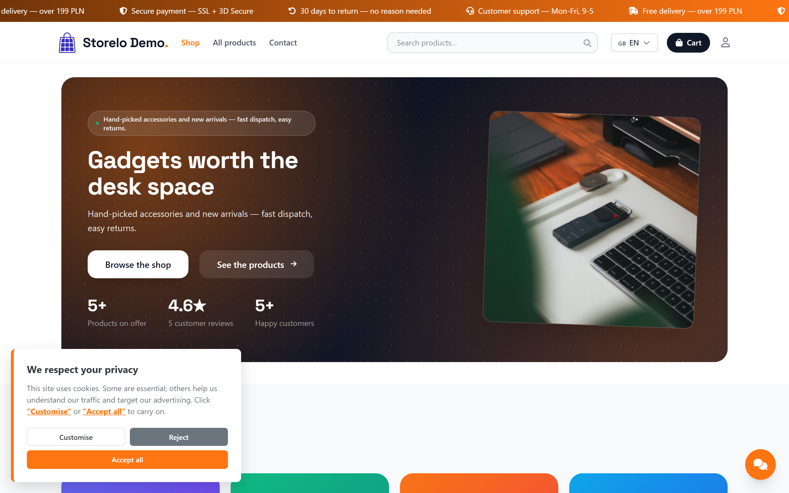
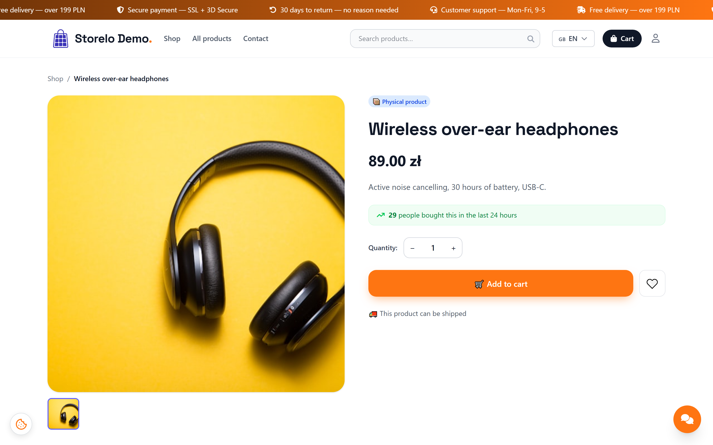
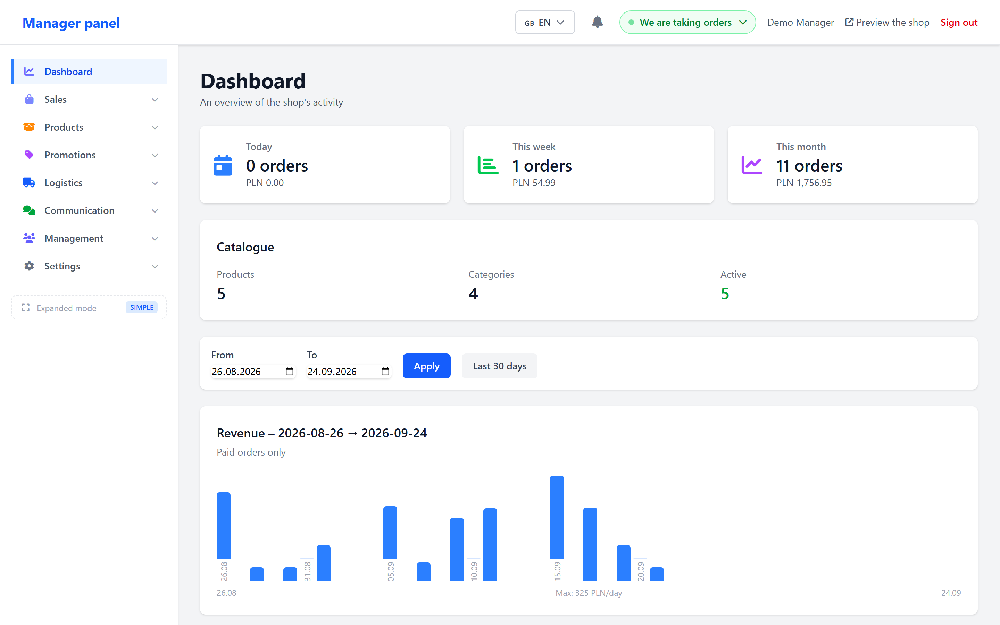
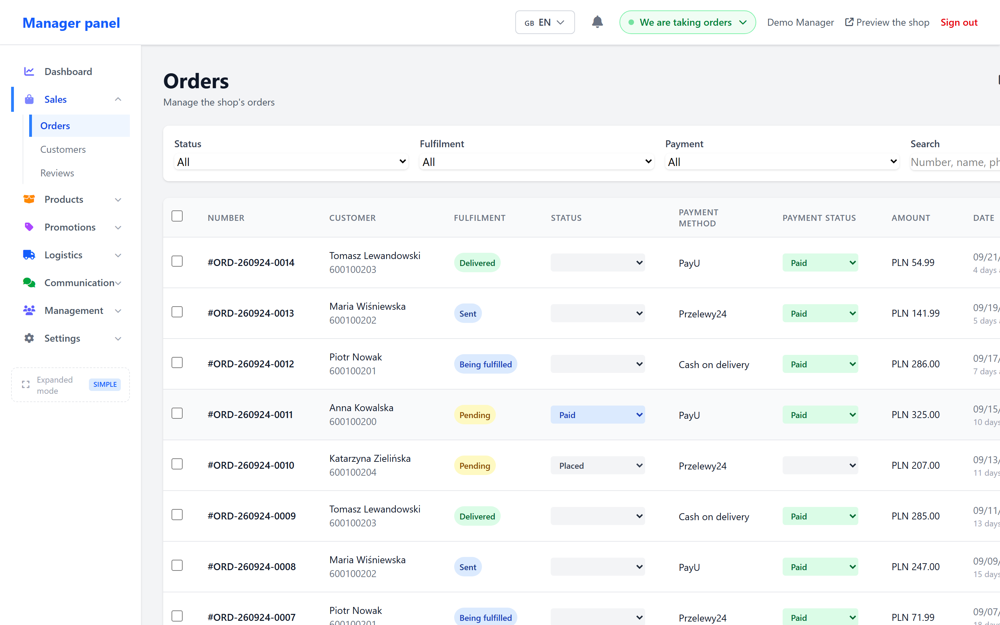
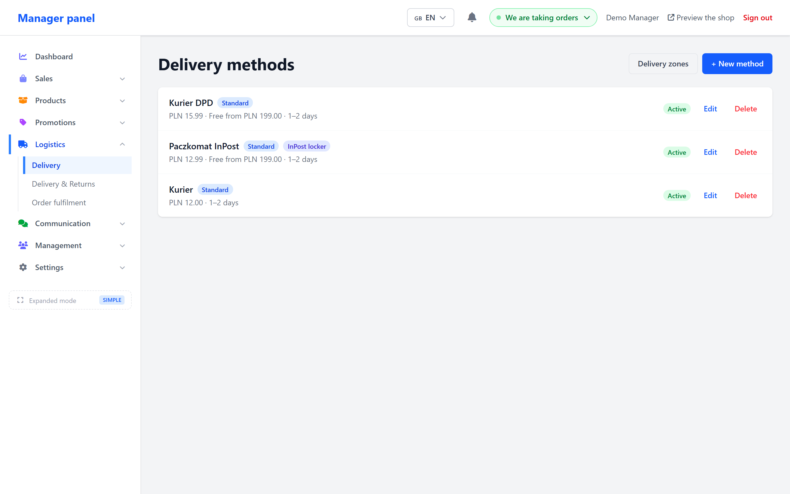

# Storelo

[](https://github.com/Prymex6/shop-system/actions/workflows/ci.yml)

Multi-tenant SaaS e-commerce platform built with Laravel 12, Vue 3 and Inertia.js. Each shop runs on its own isolated database and domain.

## What it looks like

|                                                            |                                                   |
| ---------------------------------------------------------- | ------------------------------------------------- |
|                |        |
| The storefront, built from blocks in the homepage builder  | A product page                                    |
|  |       |
| The manager's dashboard                                    | Orders, with fulfilment and payment status inline |



Delivery methods. A method that names a carrier gets a pick-a-locker step at
checkout and a one-click label from the order.

The interface is the same in Polish; the shop above is set to English through
the switcher in the header.

## Stack

- **Backend** — PHP 8.2, Laravel 12, stancl/tenancy v3.10
- **Frontend** — Vue 3 (Composition API), Inertia.js, Pinia, TailwindCSS v4
- **Database** — MySQL (database-per-tenant)
- **Real-time** — Laravel Reverb (WebSockets)
- **Build** — Vite 7, Playwright (E2E)

## Features

- Multi-tenant architecture — each shop gets its own isolated database and subdomain/custom domain
- Full e-commerce — products with variants, categories, cart, checkout, orders
- Payment gateways — Przelewy24, PayU, Tpay, Cash on Delivery
- Inventory management — multi-warehouse stock, purchase orders, RMA
- Loyalty program — points, tiers (Bronze → Diamond), rewards, referrals
- Marketing — discount codes, flash sales, email campaigns, abandoned cart recovery
- Customer accounts — OAuth (Google/Facebook), wishlists, reviews, GDPR export/deletion
- Manager panel — 58 controllers covering every aspect of shop management
- Staff panel — fulfillment, warehouse, knowledge base
- CMS — blog, page builder, homepage builder
- Security — RBAC, 2FA, fraud detection, audit logs
- Delivery — zones, methods, and InPost parcel lockers: the customer picks one at checkout, the manager buys the label with one click, and a scheduled command asks the carrier hourly where the parcel is
- Bilingual — the whole interface in Polish and English, switchable per visitor
- Integrations — OpenAI (product descriptions), InPost, SMS, Web Push, Cloudflare

## Requirements

- PHP 8.2+
- MySQL 8.0+
- Node.js 20+
- Composer

## Installation

```bash
# Clone and install dependencies
git clone https://github.com/Prymex6/shop-system.git
cd shop-system
composer install
npm install

# Environment
cp .env.example .env
php artisan key:generate

# Database (landlord)
php artisan migrate --path=database/migrations/landlord

# Assets
npm run build
php artisan storage:link
```

## Development

```bash
php artisan serve        # Laravel backend
npm run dev              # Vite (hot reload)
php artisan reverb:start # WebSocket server
php artisan queue:listen # Queue worker
```

## Testing and quality

```bash
php artisan test         # 716 feature and unit tests
npx playwright test      # end-to-end, 66 specs across four panels

composer run lint        # Pint, Laravel preset
composer run analyse     # PHPStan via Larastan, level 1, no baseline
npm run lint             # ESLint 9, Vue and TypeScript
npm run lint:i18n        # every message in every locale compiles
npm run format:check     # Prettier
```

CI runs all of it on every push and pull request. Nothing is suppressed: there
is no PHPStan baseline and no disabled rule without a comment saying why.

### A note on the translation checks

vue-i18n compiles a message the first time something renders it, not when the
page loads, and its syntax claims more characters than is obvious — `{ }` are
interpolation, `|` separates plural forms, `@` begins a link to another
message. A message it cannot parse throws in front of whoever opened that tab.
`npm run lint:i18n` compiles all of them up front, and
`tests/Unit/TranslationCatalogueTest.php` fails if a key is used and never
written, written in one language and not the other, left empty, or left behind
when the thing that rendered it went away.

## Production Deployment

`composer install` alone (as used above for local development) also installs
`require-dev` packages — including `filp/whoops`, a debug-page renderer whose
"Environment & details" tab dumps the entire `$_ENV`/`getenv()` output (DB
password, `APP_KEY`, Przelewy24/PayU/Tpay keys, Google/Facebook OAuth
secrets, Reverb secret). Combined with `APP_DEBUG=true` reaching production —
easy to do by accident when copying a `.env` between environments — this
turns an ordinary 500 error into a full secrets leak to any visitor, with
nothing logged. Deploying requires all of the following, not just `composer
install`:

```bash
composer install --no-dev --optimize-autoloader
```

And in the deployed `.env`:

```
APP_ENV=production
APP_DEBUG=false
```

Then cache the config/routes so a stale `.env` read never lingers and cold
requests aren't slower than they need to be:

```bash
php artisan config:cache
php artisan route:cache
php artisan event:cache
```

Re-run `config:cache` after every `.env` change on the server — with it
cached, Laravel stops re-reading `.env` at runtime, so an edited `.env`
alone has no effect until the cache is rebuilt.

### Queue worker

`QUEUE_CONNECTION=database` (the default) means every order confirmation
email, digital-download link, shipping SMS, and loyalty notification is
just a row in the `jobs` table until something processes it. There is no
Horizon here — a persistent worker process is required, or queued work
just accumulates silently:

```bash
php artisan queue:work --tries=3 --daemon
```

Run it under a process supervisor (systemd, Supervisor, or your host's
process manager) so it restarts automatically on crash or `deploy`. Failed
jobs are logged as `Log::critical('Queue job failed', ...)` (see
`AppServiceProvider::boot()`) and land in `failed_jobs` — point your log
monitoring at `critical`-level entries so a stuck worker or a
misconfigured mail transport actually surfaces instead of silently eating
customer-facing emails.

## Architecture

```
Central (Landlord) DB — tenants, plans, super admins, support
    │
    ├── Tenant A DB (tenant_{uuid}) — shop, products, orders, customers
    ├── Tenant B DB (tenant_{uuid}) — ...
    └── Tenant N DB (tenant_{uuid}) — ...
```

Each tenant is identified by subdomain (`shop.yourdomain.com`) or custom domain. Bootstrappers isolate database, cache, filesystem, queue and mail per request.

## Scale

|                   |                               |
| ----------------- | ----------------------------- |
| Manager panel     | 58 controllers                |
| Models            | 67                            |
| Services          | 44                            |
| Migrations        | 108                           |
| Tests             | 716 PHP, 66 Playwright specs  |
| Interface strings | 1833 keys, Polish and English |

## License

Private — all rights reserved.
